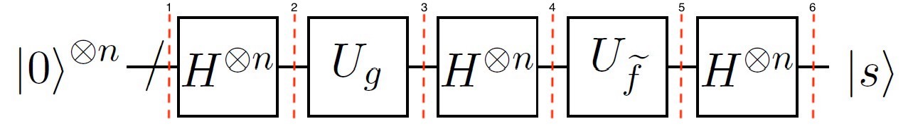
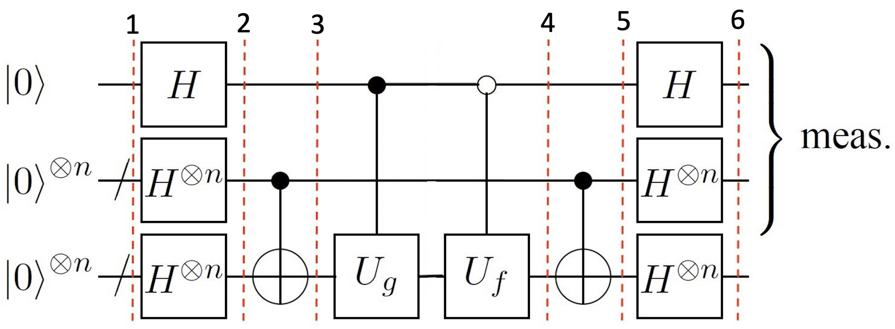

# Team Hidden Name

[Qiskit textbook issue #1394 A new chapter on a hidden shift problem](https://github.com/qiskit-community/qiskit-textbook/issues/1394)

[Qiskit textbook PR #1402 A new chapter on a hidden shift problem](https://github.com/qiskit-community/qiskit-textbook/pull/1402)

---

# Qiskit Hackathon Korea 2022 (Feb.7 - Feb.10)
[Issue #13 Implement the algorithm for the hidden shift problem and explain it!](https://github.com/qiskit-community/qiskit-hackathon-korea-22/issues/13)

## Abstract
- Study algorithms for the hidden shift problem
- Implement it by Qiskit
- Make it easy to understand!

## Description
The hidden shift problem is closely related to the dihedral hidden subgroup problem.
Understanding this problem can lead to deeper insights into those related problems and also into the cryptographic use-cases.
Implementing this algorithm via Qiskit and explaining it would be beneficial for us, and also for the Qiskit community!

We aim to make a tutorial notebook file that describes the hidden shift problem and shows how to implement it by Qiskit.

### Reference
1. M. Roetteler (2008), "Quantum algorithms for highly non-linear Boolean functions", Proceedings of the 21st Annual ACM-SIAM Symposium on Discrete Algorithms (SODA'10), pp. 448-457, [arXiv:0811.3208](https://arxiv.org/abs/0811.3208) [quant-ph]
2. D. Gavinsky, M. Roetteler & J. Roland (2011), "Quantum Algorithm for the Boolean Hidden Shift Problem", 17th International Computing & Combinatorics Conference (COCOON'11), Lecture Notes in Computer Science 6842 (Springer), pp. 158-167, [doi:10.1007/978-3-642-22685-4_14](https://doi.org/10.1007/978-3-642-22685-4_14), [arXiv:1103.3017](https://arxiv.org/abs/1103.3017) [quant-ph]
3. N. Tokareva (2015), "Bent Functions - Results and Applications to Cryptography", Academic Press. 
4. X. Bonnetain & M. Naya-Plasencia (2018), "Hidden Shift Quantum Cryptanalysis and Implications", In: T. Peyrin , S. Galbraith (eds) Advances in Cryptology – ASIACRYPT 2018, Lecture Notes in Computer Science, vol 11272, Springer, Cham, [doi:10.1007/978-3-030-03326-2_19](https://doi.org/10.1007/978-3-030-03326-2_19)
5. K. Wright, K. M. Beck, S. Debnath et al. (2019), "Benchmarking an 11-qubit quantum computer", Nat Commun 10, 5464, [doi:10.1038/s41467-019-13534-2](https://doi.org/10.1038/s41467-019-13534-2)
6. S. Bravyi & D. Gosset (2016), "Improved classical simulation of quantum circuits dominated by Clifford gates", Phys. Rev. Lett. 116, 250501, [doi:10.1103/PhysRevLett.116.250501](https://doi.org/10.1103/PhysRevLett.116.250501), [arXiv:1601.07601](https://arxiv.org/abs/1601.07601) [quant-ph]
<!-- 6. G. Kuperberg (2005), "A subexponential-time quantum algorithm for the dihedral hidden subgroup problem", SIAM Journal on Computing, 35(1), pp. 170-188, [doi:10.1137/S0097539703436345](https://doi.org/10.1137/S0097539703436345), [arXiv:quant-ph/0302112](https://arxiv.org/abs/quant-ph/0302112) -->

## Members
 - Boseong Kim [@BStar14](https://github.com/BStar14) - Slack: `@BoSeong Kim` email: `boseong14@gmail.com`
 - Inhyuk Oh [@OHINHYUK55](https://github.com/OHINHYUK55)
 - Sekang Kwon [@skk9967](https://github.com/skk9967)
 - Sehoon Bang [@hackathon-bsh](https://github.com/hackathon-bsh)
 - Junghun Phee [@BiPhee](https://github.com/BiPhee)

## Mentors
 - Prof. Hyukjoon Kwon [@hjkwon9001](https://github.com/hjkwon9001)
 - Dr. Adel Sohbi [@adelshb](https://github.com/adelshb)

---

# Hidden Shift Problem

The hidden shift problem is an oracle-based problem that is closely related to Simon's problem and factorization problem. There exists an exponential quantum-classical separation for the query complexity of the hidden shift problem over bent functions [1, 2].

Bent functions are a particular type of Boolean functions which are maximally non-linear and hard to approximate by linear or affine functions making them interesting for cryptographic purposes [3].

The known quantum advantage on the extension of the hidden shift problem to modular addition provides a threat to commonly used cryptographic primitives such as Poly1305 and CSIDH [4]. Moreover, those quantum algorithms to solve the hidden shift problem have been used to benchmark quantum computers on different hardware [5, 6].

Therefore, we focus on the hidden shift problem over bent functions in this notebook.

## Fourier-transform-accessible Algorithm

We first present the case when we have access to the Fourier transform. This quantum algorithm was first introduced in Reference [1].

### Experiment with Simulators

We can see that the result of the measurement is the hidden string `1011`.

### Experiment with Real Devices

As we can see, there is a significatly higher chance of measuring the hidden shift `1011`. The other results are due to errors in the quantum computation.

## Fourier-transform-free Algorithm

If the oracle does not provide the Fourier transform, the problem gets exponentially harder, classically. However we can still solve the problem with quantum computers within a linear number of queries. The first idea of this Fourier-transform-free algorithm was first introduced in Reference [1], and then improved in Reference [2]. We employed the latter one in this notebook.

### Experiment with Simulators

Now we see that there are 16 different outputs. Note that the binary index `b` is at the first register, so the result string is ordered in `(y, b)`. We can retrieve `s` as soon as we get four linearly independent outcomes except for the trivial output `00000`.

Thus, we get the hidden shift `1011` from the given four outcomes. Checking the dot product `(s, 1) · (y, b)` for all outcome lists as below:

| (s, 1) | (y, b) | product | (s, 1) | (y, b) | product |
|:-----:|:-----:|:-----:|:-----:|:-----:|:---------:|
| 10111 | 00000 |   0   | 10111 | 10001 |   1+1=0   |
| 10111 | 00011 | 1+1=0 | 10111 | 10010 |   1+1=0   |
| 10111 | 00101 | 1+1=0 | 10111 | 10100 |   1+1=0   |
| 10111 | 00110 | 1+1=0 | 10111 | 10111 | 1+1+1+1=0 |
| 10111 | 01000 |   0   | 10111 | 11001 |   1+1=0   |
| 10111 | 01011 | 1+1=0 | 10111 | 11010 |   1+1=0   |
| 10111 | 01101 | 1+1=0 | 10111 | 11100 |   1+1=0   |
| 10111 | 01110 | 1+1=0 | 10111 | 11111 | 1+1+1+1=0 |

### Experiment with Real Devices

In this case, however, we find that desired outputs are not distinguishable from the noise. One reason is that the Toffoli gate is very expensive in current devices. In addition, as the theoretical probability for each desired outcome is only 1/16, this algorithm is fragile to noise. It is also of great interest for quantum researchers to tackle this kind of issue through error correction or error mitigation.
